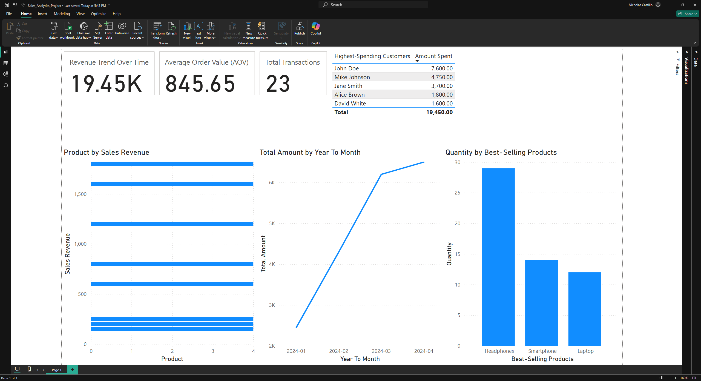

# 📊 Power BI Sales Analytics Dashboard

### 🚀 Project Overview
This Power BI dashboard provides insights into **sales trends, top customers, and product performance** using SQL Server data. It includes:

- **📈 Monthly Sales Trends (Line Chart)**
- **🛒 Best-Selling Products (Column Chart)**
- **🏆 Top 5 Customers by Revenue (Table)**
- **💰 Total Sales, Average Order Value, and Total Transactions (KPIs)**

---

### 📸 **Dashboard Screenshots**
#### 📊 Full Dashboard  

#### 🏆 KPI Cards  

#### 🛒 Product by Sales Revenue  

#### 🔥 Best-Selling Products (Quantity Sold)  

#### 💰 Top 5 Customers by Revenue  

#### 📈 Monthly Sales Trends  

---

### 🛠 **Tech Stack Used**
- **Power BI** (Data Visualization)
- **SQL Server** (Database Management)
- **DAX** (Data Analysis Expressions for Calculations)
- **GitHub** (Version Control)

---

### 📂 **How to Use**
1. **Download the `.pbix` file** from this repo.
2. Open it using **Power BI Desktop**.
3. Click **Refresh** to update with new data.
4. Explore the interactive visuals.

---

### 🔗 **Connect with Me**
📧 **Email:** mailto:Nicholas.castillo2000@gmail.com
🔗 **LinkedIn:** https://www.linkedin.com/in/nicholas-castillo-tx/
